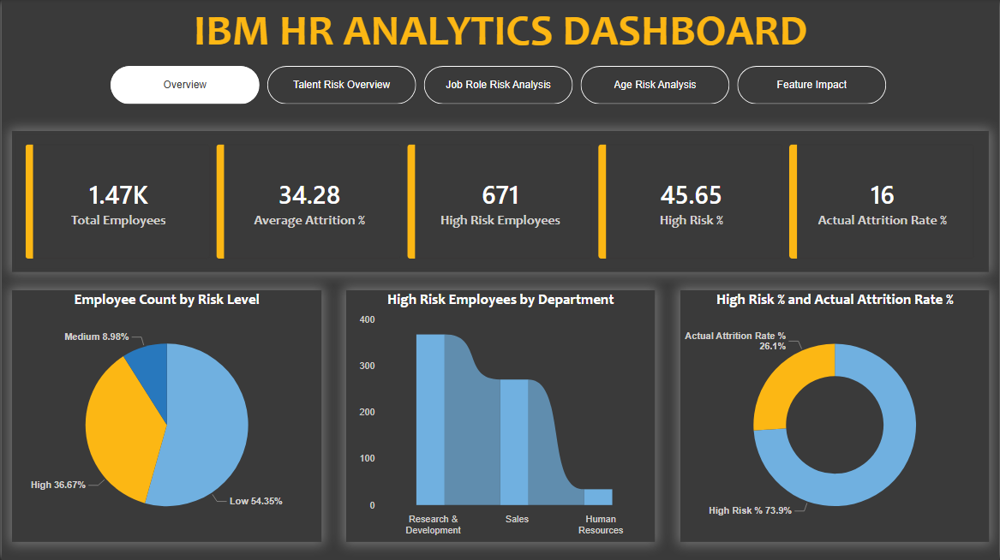
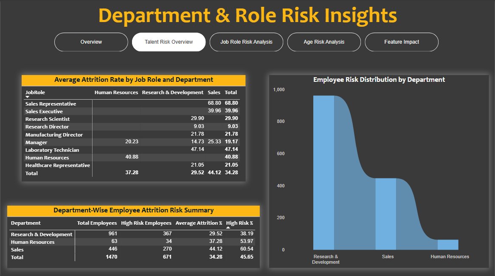
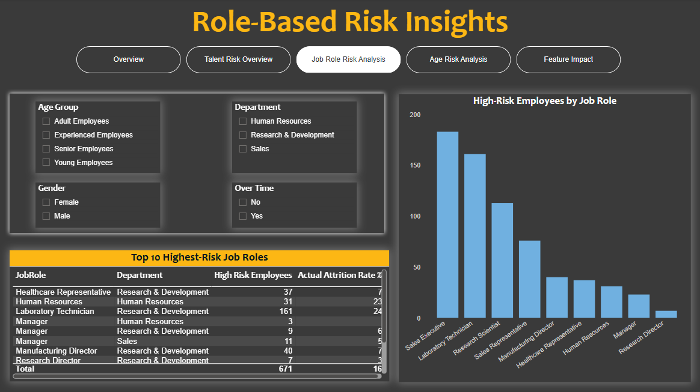
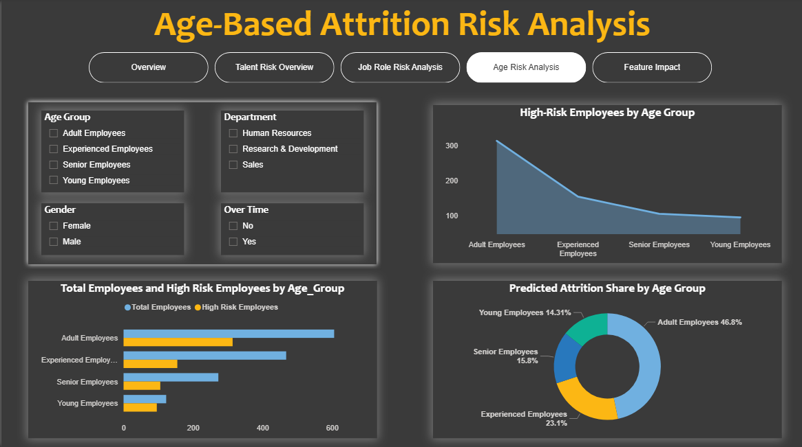
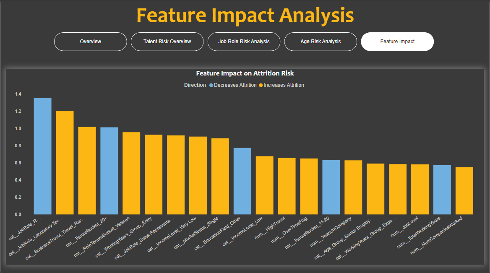

# IBM HR Analytics - Employee Attrition Risk Analysis

> Predicting and visualizing employee attrition risk using machine learning, SQL analytics, and an interactive Power BI dashboard.

---

## Project Overview

This project analyzes the **IBM HR Employee Attrition dataset** to identify employees at high risk of leaving the organization. It combines **exploratory data analysis**, **machine learning-based attrition probability scoring**, **SQL-based business intelligence queries**, and a **multi-page Power BI dashboard** to deliver actionable HR insights.

The end goal is to help HR teams proactively identify at-risk talent across departments, job roles, and age groups - before attrition occurs.

---

## Repository Structure

```
IBM_HR_Analysis/
│
├── assets/
│   ├── 01_Overview_Dashboard.png
│   ├── 02_Talent_Risk_Overview.png
│   ├── 03_Job_Role_Risk_Analysis.png
│   ├── 04_Age_Risk_Analysis.png
│   └── 05_Feature_Impact_Analysis.png
│
├── IBM_HR_Analysis.ipynb              # Main Jupyter Notebook (EDA + ML pipeline)
├── IBM_HR_Analytics_Dashboard.pbix    # Power BI dashboard file
├── WA_Fn-UseC_-HR-Employee-Attrition.csv  # Raw IBM HR dataset
├── ibm_hr_dataset_queries.sql         # SQL views and analytical queries
├── LICENSE
└── README.md
```

---

## Dataset

**Source:** [IBM HR Analytics Employee Attrition & Performance](https://www.kaggle.com/datasets/pavansubhasht/ibm-hr-analytics-attrition-dataset) (via Kaggle)

| Attribute | Details |
|---|---|
| Rows | 1,470 employees |
| Columns | 35 features |
| Target | `Attrition` (Yes / No) |
| Actual Attrition Rate | 16% |

Key features include: `Age`, `Department`, `JobRole`, `MonthlyIncome`, `OverTime`, `YearsAtCompany`, `BusinessTravel`, `MaritalStatus`, `JobSatisfaction`, `WorkLifeBalance`, and more.

---

## Methodology

### 1. Data Preprocessing & Feature Engineering
- Encoded categorical variables
- Created derived features: `Age_Group`, `Income_Level`, `TenureBucket`, `WorkingYears_Group`
- Handled class imbalance

### 2. Machine Learning Model
- Trained a classification model to generate `Attrition_Probability` scores per employee
- Assigned risk tiers: **High / Medium / Low** based on probability thresholds
- 671 employees (45.65%) classified as **High Risk**

### 3. SQL Analytics
- Loaded enriched dataset into a PostgreSQL database
- Built analytical views: `high_risk_employees`, `department_risk_summary`, `jobrole_risk_summary`
- Ran business queries: income inequality by department, burnout analysis, top risky roles per department

### 4. Power BI Dashboard
- Connected Power BI to the enriched dataset
- Built 5 interactive report pages with cross-filtering slicers

---

## Dashboard Pages

### Overview


High-level KPIs at a glance:
- **1,470** total employees | **671** high-risk employees
- **34.28%** average predicted attrition risk | **16%** actual attrition rate
- Risk distribution: 36.67% High · 8.98% Medium · 54.35% Low
- High-risk employees concentrated in **Research & Development** and **Sales**

---

### Department & Role Risk Insights


- **Sales** has the highest high-risk % at **60.54%**
- **Human Resources** follows at **53.97%**
- **Sales Representatives** carry the highest average attrition rate at **68.80%**
- **Laboratory Technicians** average **47.14%**

---

### Role-Based Risk Insights

- **Sales Executives** (~180) and **Laboratory Technicians** (~160) are the top two roles by high-risk employee count
- Slicers allow filtering by Age Group, Department, Gender, and OverTime status

---

### Age-Based Attrition Risk Analysis


- **Adult Employees (30–45)** account for **46.8%** of predicted attrition share
- **Experienced Employees (45–55)** contribute **23.1%**
- High-risk count drops sharply from Adult -> Young employees

---

### Feature Impact Analysis


Top drivers of attrition risk (from model feature importance):
- **Decreases attrition:** `JobRole_R&D`, `TenureBucket_20+`, `IncomeLevel_Low`
- **Increases attrition:** `BusinessTravel_Rarely`, `WorkingYears_Group_Entry`, `JobRole_Sales Representative`, `MaritalStatus_Single`, `OverTime`

---

## SQL Highlights

```sql
-- Department-wise risk summary
SELECT 
    "Department",
    COUNT(*) as total_employees,
    SUM(CASE WHEN "Risk_Level" = 'High' THEN 1 ELSE 0 END) as high_risk,
    ROUND(AVG("Attrition_Probability")::NUMERIC*100, 2) as avg_risk_score
FROM ibm_hr_attrition 
GROUP BY "Department" 
ORDER BY high_risk DESC;
```

Other queries included:
- Work-life burnout analysis by `BusinessTravel` × `OverTime`
- Salary percentile distribution (P25/P50/P75) within departments
- Top 3 riskiest job roles per department using `DENSE_RANK()`
- Department-level risk contribution % to company total

Full query file: [`ibm_hr_dataset_queries.sql`](ibm_hr_dataset_queries.sql)

---

## Key Findings

| Insight | Detail |
|---|---|
| Highest-risk department | Sales (60.54% high-risk rate) |
| Highest-risk job role | Sales Representative (68.80% avg attrition rate) |
| Biggest age group risk | Adult Employees (46.8% of attrition share) |
| Top attrition driver | Overtime + Entry-level tenure + Single marital status |
| Model-flagged high risk | 671 of 1,470 employees (45.65%) |

---

## Tools & Technologies

| Tool | Purpose |
|---|---|
| Python (Pandas, Scikit-learn) | Data preprocessing & ML modeling |
| Jupyter Notebook | EDA & pipeline documentation |
| PostgreSQL | SQL analytics & views |
| Power BI | Interactive dashboard |
| GitHub | Version control |

---

## 🚀 Getting Started

### Run the Notebook
```bash
git clone https://github.com/Aakriti-23/IBM_HR_Analysis.git
cd IBM_HR_Analysis
jupyter notebook IBM_HR_Analysis.ipynb
```

### Load SQL Queries
1. Import the enriched CSV into a PostgreSQL database as `ibm_hr_attrition`
2. Run `ibm_hr_dataset_queries.sql` to create views and explore results

### Open the Dashboard
Open `IBM_HR_Analytics_Dashboard.pbix` in **Power BI Desktop** (free download from Microsoft)

---

## Author

**Aakriti** - [GitHub Profile](https://github.com/Aakriti-23)

---

## License

This project is for educational and portfolio purposes. The dataset is publicly available via IBM/Kaggle.
